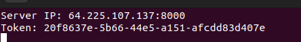
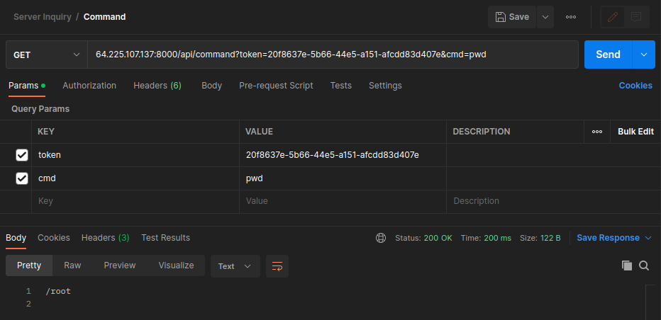

# ServerInquiry

ServerInquiry is an API that enables communication between external applications and a server, opening ports and generating tokens that allow commands to be sent and executed more conveniently. In addition, thanks to its functionality, this API can improve the efficiency of data transmission and automate processes, providing a simpler and more effective solution for interaction between applications and servers.

## Requirements

- Minimum requirements
  - RAM: 216MB
  - CPU: 1 core
  - Memory: 500MB
  - Debian Server

## Installation

Follow the following commands on your server to do the installation correctly
```bash
$ curl -LO https://raw.githubusercontent.com/fzbian/server-inquiry/main/tools/install.sh
$ chmod +x install.sh
$ ./install.sh
```
The console will return the following message
```bash
ServerInquiry (1.0.0b) is ready for use.
```
Now you can use `server-inquiry` at any time.

## API Reference

### Health
```http
  GET /api/health?token=<token>
```

| Parameter | Type     | Description               |
|:----------|:---------| :------------------------ |
| `token`   | `string` | the token generated by running the code |

### Command
```http
  GET /api/command?token=<token>&cmd=<cmd>
```

| Parameter | Type     | Description               |
|:----------|:---------| :------------------------ |
| `token`   | `string` | the token generated by running the code |
| `cmd`     | `string` | the command to request |

## Contribute

We are open to, and grateful for, any contributions made by the community.

## License

This project is licensed under the MIT License. See the [LICENSE](LICENSE.md) file for more information.

## Example

By running `server-inquiry` the console will return this information



You can implement the request in your application code, here is an example code in go.

```go
package main

import (
	"fmt"
	"io"
	"net/http"
)

var (
	ip      = "64.225.107.137"
	port    = "8000"
	token   = "20f8637e-5b66-44e5-a151-afcdd83d407e"
	command = "pwd"
)

func main() {
	resp, err := http.Get("http://" + ip + ":" + port + "/api/command?token=" + token + "&cmd=" + command)
	if err != nil {
		fmt.Println("Error in the request: ", err)
	}
	defer func(Body io.ReadCloser) {
		err := Body.Close()
		if err != nil {
			fmt.Println(err)
		}
	}(resp.Body)

	body, err := io.ReadAll(resp.Body)
	if err != nil {
		fmt.Println("Error when reading the answer: ", err)
	}

	fmt.Println(string(body))
}
```

Or
If you wish to make a direct request



The two examples will answer the same:
```bash
/root
```

## Acknowledgments

 - [AndresXLP](https://github.com/AndresXLP)